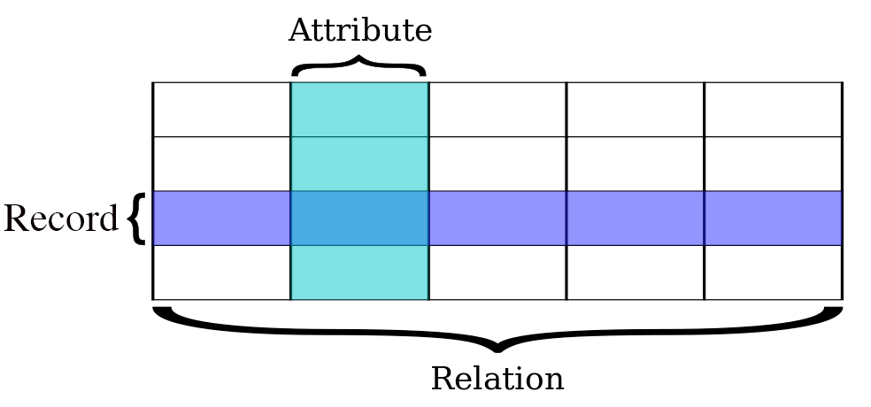

# Introduction to SQL

## Contents
- [Background](#background)
- [Understanding Relational Databases](#understanding-relational-databases)
	- [Databases](#databases)
	- [Tables](#tables)
	- [Relational Databases](#relational-databases)
- [SQL](#sql)
- [Sources](#sources)

## Background
**SQL** stands for *Structured Query Language* and is a standard language for storing, manipulating, and retrieving data in databases. [SQL comes in a variety of flavors](https://stackoverflow.com/questions/1326318/difference-between-different-types-of-sql), and for this workshop, we will be working with [PostgreSQL](https://www.postgresql.org/) due to its popularity in industry and open source nature. Before we dive into SQL, it's a good idea to first gain an understanding of relational databases, which SQL was made to manage.

## Understanding Relational Databases
### Databases
Put simply, a **database** is an organized collection of data. However, with such a loose definition, there can exist a wide variety of databases, some of which must be more effective than others. For the purpose of learning SQL, we seek to understand a special type of database known as the *relational database*, which derives its strengths from the restrictions that it has over the vaguely defined database. This way of organizing data has found great success in practice, as most databases today are structured relationally. To properly understand relational databases, we first need to understand tables and their properties.

### Tables
Data is commonly stored in tables, but in the context of relational databases, truly tabular data exhibits particular qualities that make them effective stores of data. In a **table**, each row denotes a record or observation of data, and each column denotes a variable or attribute of the data. For example, suppose we have a table containing data about three Data Science at UCSB officers.

name | major | favorite food
--- | --- | ---
Samantha | Statistics | noodles
Arthur | Computer Science | hamburgers
Jonny | Communication | lobster rolls

We can see that each non-header row contains data pertaining to a single officer. Moreover, for each officer, we have three attributes separated by the three columns: `name`, `major`, and `favorite food`.

The takeaway here is that for any data to be considered as tabular data,
1. each row must represent an instance of a particular class such that from one row to the next, the class remains the same
2. each column must represent an attribute or facet of the data

### Relational Databases
With an understanding of tables and their properties, we can now begin to understand the relational database. We will start by presenting an example of a non-relational database. Suppose we are a university where students take two courses per quarter, and we store enrollment data in a database. Our database might consist of the following tables:

`course_enrollments`

student_name | major | year | courseID | professor | location | quarter | time_of_enrollment | grading_option
--- | --- | --- | --- | --- | --- | --- | --- | ---
Samantha | Statistics | 4 | PSTAT 101 | T. Bayes | PSYCH 1924 | SPRING | 2018-04-15T22:42:03+00:01 | letter grade
Arthur | Computer Science | 3 | CS 101 | A. Lovelace | HFH 1901 | SPRING | 2018-04-12T22:42:10+23:32 | p/np
Jonny | Communication | 3 | COMM 101 | M. King Jr. | CAMPBHALL | SPRING | 2018-04-13T22:42:07+23:43 | p/np
Samantha | Statistics | 4 | WRIT 101 | E. Hemingway | HSSB 2322 | SPRING | 2018-04-15T22:42:03+05:23 | p/np
Arthur | Computer Science | 3 | WRIT 101 | E. Hemingway | HSSB 2322 | SPRING | 2018-04-12T22:42:10+26:26 | letter grade
Jonny | Communication | 3 | WRIT 101 | E. Hemingway | HSSB 2322 | SPRING | 2018-04-13T22:42:08+23:59 | letter grade

`courses`

courseID | course_name | professor | location | days
--- | --- | --- | --- | ---
WRIT 101 | Writing Internationally Bestselling Novels | E. Hemingway | HSSB 2322 | M W F
CS 101 | Solving NP-complete Problems in P Time | A. Lovelace | HFH 1901 | T R
COMM 101 | Public Speaking on a National Stage | M. King Jr. | CAMPBHALL | M W
PSTAT 101 | Literally Predicting the Future | T. Bayes | PSYCH 1924 | M W F

In this example, the tables `course_enrollments` and `courses` indeed constitute a database in the sense that the two tables are considered organized data; however, due to the way it's structured, this database doesn't fully exhibit the benefits offered by storing data in numerous tables. These benefits would be fully exhibited in the case of a *relational database*.

A **relational database** is a database which is organized based on the principals of the [relational model](https://en.wikipedia.org/wiki/Relational_model). To understand these principals and the benefits they provide, we will begin with a critique of our university database.

A weakness of the database is redundancy; there are multiple cases where data is unnecessarily repeated. In the table `course_enrollments`, each student's name, major, and year are stored twice because they each enrolled in two courses. Furthermore, in the same table, data about the course `WRIT 101`'s location and professor occurs multiple times. Not only is data repeated within the table `course_enrollments`, but also across different tables; data regarding each course's professor and location is stored in both tables. Redundancy in databases is considered a weakness because it implies wasted storage space. Why store any more data than you need to? Additionally, if data occurs in multiple instances, any updates to that data would have to occur in all of those instances. For example, if the location for course `WRIT 101` were to change to `SSMS 1303`, we would have to update our data on four occasions (three times in `course_enrollments` and once in `courses`).

**Relational databases aim to store data in a way that minimizes wasted storage while maintaining accessibility of that data.** To understand how, it helps to adopt the terminology associated with relational databases, some of which we've already encountered. In dealing with relational databases, rows of a table are referred to as **records** or **tuples** and columns as **attributes** or **fields**. Additionally, tables are called **relations**, as a table communicates the relationships between each record and attribute.

In order to eliminate redundancy, each relation (table) in a relational database strictly represents a single type of entity. In our case, the table `course_enrollments` should represent instances of course enrollment and the table `courses` should represent courses. Our database violates this rule because the relation `course_enrollments` contains information about three entity types: course enrollments, courses, and students. Because an entity type should be represented by its own relation, it seems that we might want to introduce a third relation to represent students.

The restriction that each relation must represent a single entity type might seem detrimental because it requires that we separate information about different entity types. In the case of the relation `course_enrollments`, we would lose any information about *which student* is enrolling for *which classes* and are left only with fields `quarter`, `time_of_enrollment`, and `grading_option`. However, this is not the case, relations in a relational database can remain linked through the use of *keys*. **Keys** are unique identifiers for each record in a relation and manifest in the form of an added column. They are then referenced in other tables to maintain any relational information. It is important to emphasize the uniqueness of keys, as the notion that any one key will never occur more than once in the same relation is what empowers them to be used as identifiers (e.g., students need unique ID numbers to prevent one student from being mistaken for another).

At this point, it's totally understandable if you still aren't clear on what a relational database is or why we should use them. This may be a case in which the best way to understand is through example, so we'll try to recreate our university database keeping in mind the discussed principals of relational databases. An improved version of our database might comprise the following tables:

`course_enrollments`

enrollmentID | studentID | courseID | quarter | time_of_enrollment | grading_option
--- | --- | --- | --- | --- | ---
1 | 1001 | PSTAT 101 | SPRING | 2018-02-15T22:42:03+00:01 | letter grade
2 | 1002 | CS 101 | SPRING | 2018-02-12T22:42:10+23:32 | p/np
3 | 1003 | COMM 101 | SPRING | 2018-02-13T22:42:07+23:43 | p/np
4 | 1001 | WRIT 101 | SPRING | 2018-02-15T22:42:03+05:23 | p/np
5 | 1002 | WRIT 101 | SPRING | 2018-02-12T22:42:10+26:26 | letter grade
6 | 1003 | WRIT 101 | SPRING | 2018-02-13T22:42:08+23:59 | letter grade

`courses`

courseID | course_name | professor | location | days
--- | --- | --- | --- | ---
WRIT 101 | Writing Internationally Bestselling Novels | E. Hemingway | HSSB 2322 | M W F
CS 101 | Solving NP-complete Problems in P Time | A. Lovelace | HFH 1901 | T R
COMM 101 | Public Speaking on a National Stage | M. King Jr. | CAMPBHALL | M W
PSTAT 101 | Literally Predicting the Future | T. Bayes | PSYCH 1924 | M W F

`students`

studentID | name | major | year
--- | --- | --- | ---
1001 | Samantha | Statistics | 4
1002 | Arthur | Computer Science | 3
1003 | Jonny | Communication | 3

This newer database is indeed a relational database and conveys the same exact information as the previous database while adding some efficiency. To solidify an understanding of relational databases, let's review the numerous changes we've made.

As discussed, we've added a relation to represent students, and each relation in the new database represents only one entity type. As a result, our new database exhibits much less redundancy. However, since we removed information about students and courses from the relation `course_enrollments`, we needed a way of maintaining the information of who enrolled in which course, and that's when keys come into play.

We introduced keys into our database by adding a column of unique identifiers to each of the relations `course_enrollments` and `students` (`courses` already had a uniquely identifying field, `courseID`). The identifiers `courseID` and `studentID` are then referenced in the relation `course_enrollments`, allowing us to maintain the information we didn't want to lose.

Our relational database provides the following benefits over its non-relational counterpart:
- With the relational database, any changes to courses or students need only be implemented in their respective tables, rather than in multiple instances as would be required with the non-relational database.
- As our three students continue to register for classes in following quarters, for each new registration, we need only add a single record comprising 6 fields as opposed to 9.
- Each non-identifying point of data occurs only once in the relational database.

In short, by introducing keys and referencing them instead of repeating information in other tables, we were able to make our database more easily maintainable and memory efficient.

While the changes we've made to the database improve its overall efficiency, we did suffer losses in data accessibility. Whereas with the non-relational database, one could figure out the names of students enrolled in course `PSTAT 101` by examining only the table `course_enrollments`, the same cannot be said for the relational database. At best, without leaving the relation `course_enrollments`, one could only figure out that the student with `studentID == 1001` is enrolled for `PSTAT 101`. Thus, we'd have to examine the relation `students` to learn that it's Samantha who is enrolled for PSTAT 101. While this might seem difficult, it's exactly the sort of thing SQL was made for! Now that we understand the ideas behind relational databases, we can comfortably begin learning the fundamentals of SQL.

Now let's move onto the tutorial! Open up your terminal and navigate to the `sql_de_mayo` folder. Type `jupyter notebook beginner\beginner_notebook.ipynb` to begin.  

## Sources
This curriculum has drawn heavily the following online resources:
- [Wikipedia: Relational database](https://en.wikipedia.org/wiki/Relational_database)
- [w3schools' SQL tutorial](https://www.w3schools.com/sql/)
