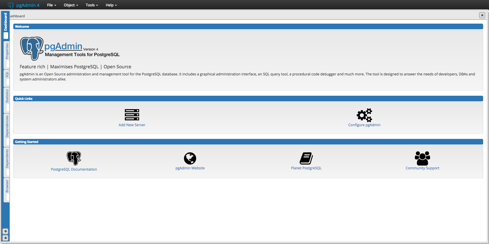

# Installation

NOTE: Throughout this guide, `$` denotes the linux shell prompt. So, when the guide instructs to enter a command as such,
```
$ [COMMAND]
```
the command `[COMMAND]` should be entered into a linux shell, which can be accessed through a program such as `Terminal` (preinstalled on MacOS).


## Installing PostgreSQL
### MacOS
1. Get the Homebrew package manager by running the following command in your Terminal:
```
$ /usr/bin/ruby -e "$(curl -fsSL https://raw.githubusercontent.com/Homebrew/install/master/install)"
```
Then, upgrade with the following command
```
$ brew upgrade
```
2. Install PostgreSQL with the following command:
```
$ brew install postgresql
```
3. Start PostgreSQL by running the following command:
```
$ pg_ctl -D /usr/local/var/postgres start
```
4. Check that you have installed PostgreSQL properly by checking the version number
```
$ postgres -V
```
You should see
```
$ postgres -V
postgres (PostgreSQL) 10.3
```

Congrats! You've successfully installed PostgreSQL on your computer!

## Installing pgAdmin4
At this point, PostgreSQL should be running on your computer, but we still need a way to easily work with it. [pgAdmin4](https://www.pgadmin.org/) provides a graphical user interface (GUI) to do just that. Please follow these instructions to install it.
### Macos
1. Follow [this link](https://www.postgresql.org/ftp/pgadmin/pgadmin4/v3.0/macos/) and download the .dmg file named `pgadmin4-3.0.dmg`.
2. Open the downloaded file and drag the pgAdmin4 icon into your `Applications` folder.

That's it! Launch the application and a browser window should open with pgAdmin 4 loaded up. It should look something like this




### Interactive Installer
Follow [this link](https://www.enterprisedb.com/downloads/postgres-postgresql-downloads) and download the **PostgreSQL 10.3** installer for your operating system.

[Here](https://support.microsoft.com/en-us/help/13443/windows-which-operating-system) is how Windows users can find out which operating system they are running.

For our purposes, we'll be installing PostgreSQL with default options. To do so, follow these steps:
1. Install PostgreSQL in the default location: `/Library/PostgreSQL/10` on MacOS and `[WINDOWS INSTALL LOCATION]` on Windows.
2. Install all components provided by the installer. This includes:
   - PostgreSQL Server
   - pgAdmin 4
   - Stack Builder
   - Command Line Tools
3. As a result of our install location, the data directory will be `/Library/PostgreSQL/10/data` on MacOS and `[WINDOWS DATA LOCATION]` on Windows.
4. Please choose a password for your database superuser and remember it.
5. Select the default port number of `5433`.
6. Select the default locale.

**Result**
For Mac users, the pre-installation summary should read as follows:
```
Installation Directory: /Library/PostgreSQL/10
Server Installation Directory: /Library/PostgreSQL/10
Data Directory: /Library/PostgreSQL/10/data
Database Port: 5433
Database Superuser: postgres
Operating System Account: postgres
Database Service: postgresql-10
Command Line Tools Installation Directory: /Library/PostgreSQL/10
pgAdmin4 Installation Directory: /Library/PostgreSQL/10/pgAdmin 4
Stack Builder Installation Directory: /Library/PostgreSQL/10
```

Exit the installer with the `launch Stack Builder upon exit` option selected.


## Windows

# Setup

In order to start writing SQL code as soon as possible at the workshop, we'll configure our databases and load them with the required data.
