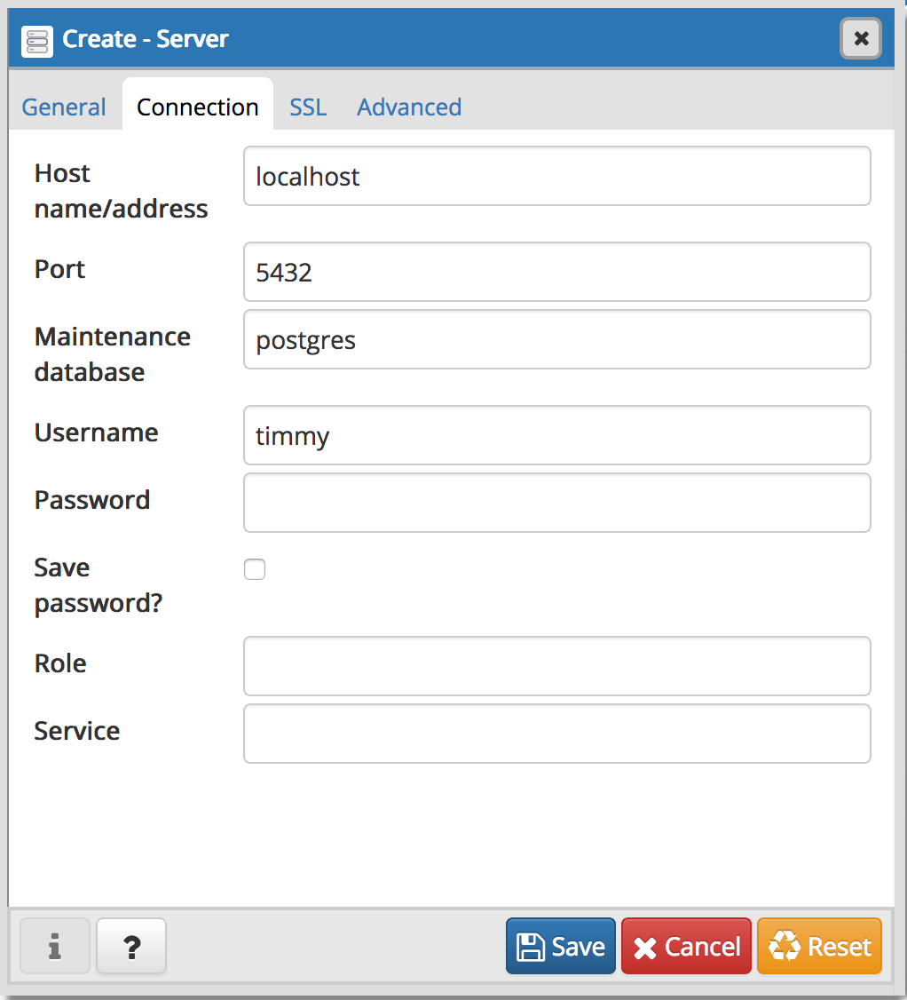

# Installation

NOTE: Throughout this guide, `$` denotes the linux shell prompt. So, when the guide instructs to enter a command as such,
```
$ [COMMAND]
```
the command `[COMMAND]` should be entered into a linux shell, which can be accessed through a program such as `Terminal` (preinstalled on MacOS).

## Contents
- [Installing PostgreSQL](#installing-postgresql)
- [Loading Data into Databases](#loading-data-into-databases)
- [Configuring Jupyter Notebook to run PostgreSQL](#configuring-jupyter-notebook-to-run-postgresql)

## Installing PostgreSQL
We've compiled the commands needed to install PostgreSQL into a single shell script. The program is installed through a popular package manager called Homebrew. Please follow these instructions to run the installation script:

1. Clone this repository (copy its contents onto your machine) by running the following command in your terminal:
```
$ git clone https://github.com/timothydnguyen/sql_de_mayo
```
2. Navigate within the cloned repository to the directory containing the installation script using the following command:
```
$ cd sql_de_mayo/installation_and_setup
```
3. Execute the script with the following command:
```
$ ./install_psql.sh
```
4. Check that you have installed PostgreSQL properly by checking the version number with the following command:
```
$ postgres -V
```
You should see the following output:
```
$ postgres -V
postgres (PostgreSQL) 10.3
```

Congrats! You've successfully installed PostgreSQL and started a server for it on your Mac!

At any point, if you wish to kill the server, enter the following command into your terminal:
```
$ pg_ctl stop -D /usr/local/var/postgres
```


## Loading Data into Databases
We will load a couple data sets into our PostgreSQL server to be accessible as databases.

### Northwind
The Northwind database contains the sales data for a fictitious company called Northwind Traders, which imports and exports specialty foods from around the world. We will be using [code written by Github user *pthom*](https://github.com/pthom/northwind_psql.git) to quickly set up this database. Follow these instructions to run the code.

1. In your terminal, navigate within the previously cloned repository (`sql_de_mayo`) to the directory containing the northwind database setup script. Assuming you haven't touched your terminal since the last set of terminal instructions, the command to do so should be as follows:
```
$ cd db_setup
```
2. From here, simply run the script to instantiate the Northwind database with the following command:
```
$ ./create_db.sh
```

## Configuring Jupyter Notebook to run PostgreSQL
We'll be using [Jupyter Notebooks](http://jupyter.org/) to write our SQL queries. Once set up, Jupyter notebooks are very interactive and easy to use, making them a good choice for learning. Notebooks typically set up to work with Python code, but we've written a script to configure them to run on a [PostgreSQL kernel](https://github.com/bgschiller/postgres_kernel).

1. In your terminal, navigate back to `sql_de_mayo`. If you haven't done anything since the previous set of instructions, the command should be as follows:
```
$ cd ..
```
2. Then, run the jupyter setup script with the following command:
```
$ ./jupyter_setup.sh
```

That's it. Congratulations, you should be set up now!


# ------- STOP HERE (DEPRECATED) --------

## Installing pgAdmin4
At this point, PostgreSQL should be running on your computer, but we still need a way to easily work with it. [pgAdmin4](https://www.pgadmin.org/) provides a graphical user interface (GUI) to do just that. Please follow these instructions to install it.

1. Follow [this link](https://www.postgresql.org/ftp/pgadmin/pgadmin4/v3.0/macos/) and download the .dmg file named `pgadmin4-3.0.dmg`.
2. Open the downloaded file, `pgadmin4-3.0.dmg`, by double-clicking it and drag the pgAdmin4 icon into your `Applications` folder.

That's it, you've installed pgAdmin4! Launch the application and a browser window should open with pgAdmin 4 loaded up. It should look something like this


Now, we need to add a server so pgAdmin knows where to look for data. To do so, we'll first need to find our configured user's username. Please follow these instructions to do so:
1. Launch the command line interface for PostgreSQL by running the following command:
```
$ psql postgres
```
You should be greeted by the psql prompt, which looks like this:
```
psql (10.3)
Type "help" for help.
postgres=#
```
2. Then, run the following command (starting after the `#`) to list all configured users on your PostgreSQL server:
```
postgres=# \du
```
You should see something like this:
```
postgres=# \du
                                      List of roles
   Role name    |                         Attributes                         | Member of
-------------+------------------------------------------------------------+-----------
 timmy        | Superuser, Create role, Create DB, Replication, Bypass RLS | {}
```
3. Take note of the name listed for your configured user, we'll be entering it into pgAdmin.

Now that we have our username, lets return to pgAdmin and add a server
1. From the pgAdmin dashboard, click `Add New Server`, and you should see a window pop up.
2. In the popup window, you should be in the `General` tab. Here, you can enter any name for your server into the `name` field, but let's go with `sql_de_mayo` for simplicity's sake.
3. At the top of the popup window, click `Connection` to switch to that tab. Here, enter `localhost` into the `Host name/address` field. Additionally, in the `Username` field, replace `postgres` with the username you found in the previous section. Before clicking `save`, your window should look as follows (with your username in place of `timmy`):


Once you click `save` and the server is added, you should see `sql_de_mayo` (or whatever server name you chose) listed under `Servers` in the Browser pane on the left of the pgAdmin window. At this point your local server is configured with pgAdmin, but it contains no data, so let's load some in!


### old mac install
1. Get the Homebrew package manager by running the following command in your Terminal:
```
$ /usr/bin/ruby -e "$(curl -fsSL https://raw.githubusercontent.com/Homebrew/install/master/install)"
```
2. Upgrade homebrew by running the following command:
```
$ brew upgrade
```
3. Install PostgreSQL by running the following command:
```
$ brew install postgresql
```
4. Start PostgreSQL by running the following command:
```
$ pg_ctl -D /usr/local/var/postgres start
```
5. Check that you have installed PostgreSQL properly by checking the version number with the command `$ postgres -V`. You should see the following output.
```
$ postgres -V
postgres (PostgreSQL) 10.3
```


### Interactive Installer
Follow [this link](https://www.enterprisedb.com/downloads/postgres-postgresql-downloads) and download the **PostgreSQL 10.3** installer for your operating system.

[Here](https://support.microsoft.com/en-us/help/13443/windows-which-operating-system) is how Windows users can find out which operating system they are running.

For our purposes, we'll be installing PostgreSQL with default options. To do so, follow these steps:
1. Install PostgreSQL in the default location: `/Library/PostgreSQL/10` on MacOS and `[WINDOWS INSTALL LOCATION]` on Windows.
2. Install all components provided by the installer. This includes:
   - PostgreSQL Server
   - pgAdmin 4
   - Stack Builder
   - Command Line Tools
3. As a result of our install location, the data directory will be `/Library/PostgreSQL/10/data` on MacOS and `[WINDOWS DATA LOCATION]` on Windows.
4. Please choose a password for your database superuser and remember it.
5. Select the default port number of `5433`.
6. Select the default locale.

**Result**
For Mac users, the pre-installation summary should read as follows:
```
Installation Directory: /Library/PostgreSQL/10
Server Installation Directory: /Library/PostgreSQL/10
Data Directory: /Library/PostgreSQL/10/data
Database Port: 5433
Database Superuser: postgres
Operating System Account: postgres
Database Service: postgresql-10
Command Line Tools Installation Directory: /Library/PostgreSQL/10
pgAdmin4 Installation Directory: /Library/PostgreSQL/10/pgAdmin 4
Stack Builder Installation Directory: /Library/PostgreSQL/10
```

Exit the installer with the `launch Stack Builder upon exit` option selected.


## Windows

# Setup

In order to start writing SQL code as soon as possible at the workshop, we'll configure our databases and load them with the required data.
