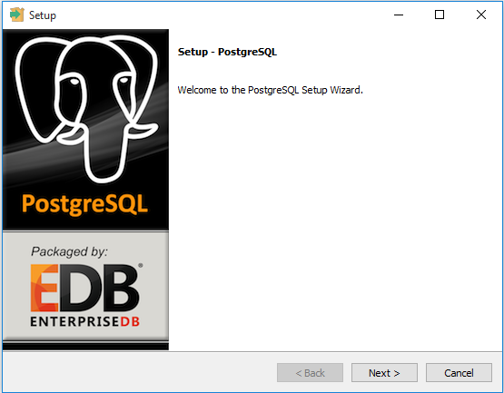
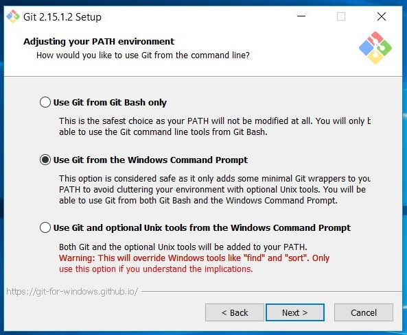
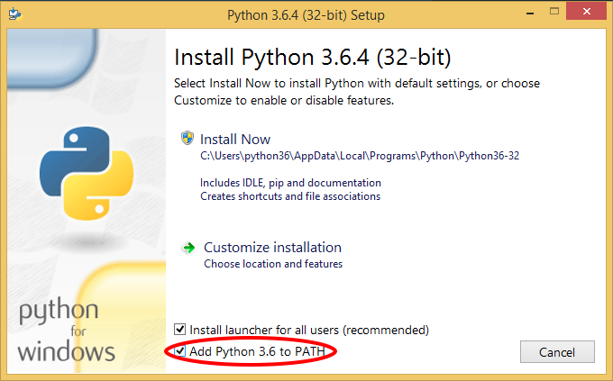
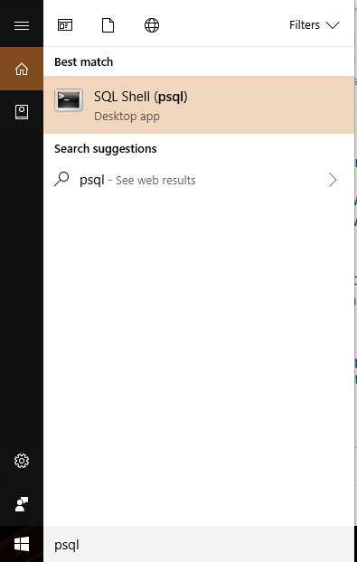
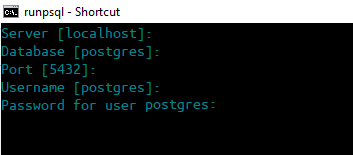
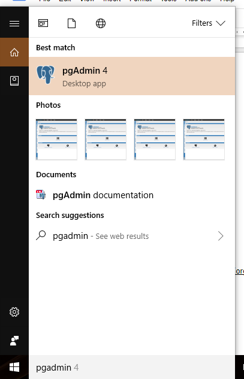
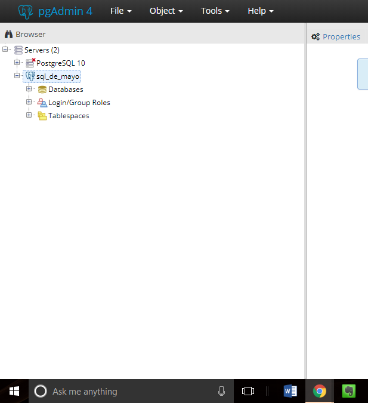
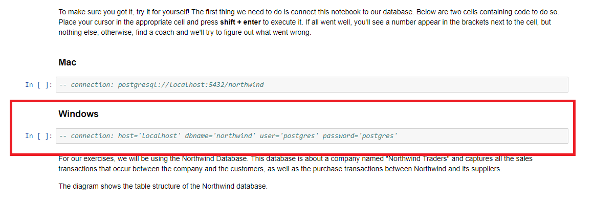
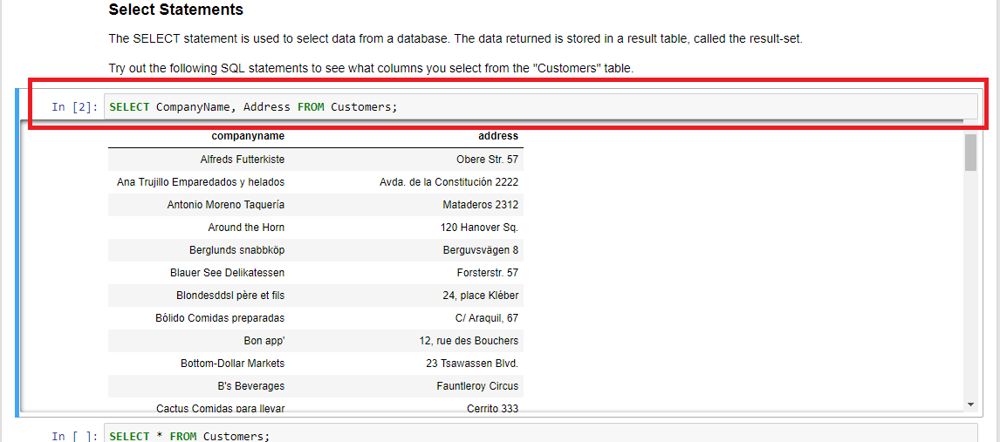

## Windows

# Setup

In order to start writing SQL code as soon as possible at the workshop, we'll configure our databases and load them with the required data.

# Installation

NOTE: Throughout this guide, `>` denotes the windows command prompt. So, when the guide instructs to enter a command as such,
```
> [COMMAND]
```
the command `[COMMAND]` should be entered into a command prompt, which is natively installed on windows.

## Contents
- [Installing PostgreSQL](#installing-postgresql)
- [Installing PostgreSQL Kernel](#installing-psql-kernel)

## Installing PostgreSQL

This section is heavily drawn from PostgrSQLTutorial's [Installing PostgreSQL walkthrough](http://www.postgresqltutorial.com/install-postgresql/).


Go to PostgreSQL's [installer](https://www.enterprisedb.com/downloads/postgres-postgresql-downloads) page and choose the appropriate bundle depending on whether your computer is 32 or 64 bit.


Once you have chosen the appropriate bit version download the program and once that is complete double click the .exe file (shown below).


You should be prompted with the following window which you will use to set the appropriate options for PostgreSQL.




Create a password for your user. We will be setting **postgres** as your username **and** password for troubleshooting issues. This can be changed later if needed.

PostgreSQL utilizes port 5432 so when prompted to enter port, **enter 5432**.
Choose the default locale for PostgreSQL, and you should be done with the installation process!

## Installing Git

To check if you already have git installed, run the following command in your terminal:
```
> git status
```

If you receive the message:

```
fatal: Not a git repository (or any of the parent directories): .git
```

then you have git installed and can move on to the next section.

If you receive the message:
```
'git' is not recognized as an internal or external command, operable program or batch file.
```
then you will need to install Git.

Follow this [link](https://git-scm.com/download/win) to download Git for windows.

During the installation process, select "Use Git rom the Windows Command Prompt" when you get to the "Adjusting your PATH environment" page. This is the only setting that needs to be changed.



After installation, run the following command in your terminal again to ensure Git works:
```
> git status
```

## Installing Python

To check if you already have Python installed, run the following command in the terminal:
```
> py --version
```

If you receive a message that indicates you have Python version 3.X, you can move on to the next section.

If you receive the message:

```
'py' is not recognized as an internal or external command, operable program or batch file.
```

or if you receive a message that indicates you have Python version 2.X, you will need to install the latest version of [Python (version 3.6.5)](https://www.python.org/downloads/).

During the Python instllation process, you will need to check the box that adds Python 3.6 to PATH.



After installation, run the following command in your terminal again to ensure Python works:
```
> py --version
```


## Installing PostgreSQL Kernel
We've compiled the commands needed to run `PostgreSQL` within a `jupyter notebook`. This step requires that PostgreSQL be installed from the previous step.

1. Clone this repository (copy its contents onto your machine) by running the following command in your terminal:
```
> git clone https://github.com/timothydnguyen/sql_de_mayo
```
2. Navigate within the cloned repository to the directory containing the installation script using the following command:
```
> cd sql_de_mayo/installation_and_setup/windows
```
3. Execute the script with the following command:
```
> jupyter_setup.bat
```

4. You can utilize by entering the following commands to open a jupyter notebook inside your virtualenv:

```
> cd ../..
```

   And then:

```
> jupyter notebook
```
Upon entering this you should be able to create both python and PostgreSQL kernels!


## Loading Data into Databases

We will load a couple data sets into our PostgreSQL server to be accessible as databases.


### Northwind

The Northwind database contains the sales data for a fictitious company called Northwind Traders, which imports and exports specialty foods from around the world. We will be utilizing `psql`, the terminal installed with PostgreSQL.

First use the `window` button to search *psql*, upon opening the application you should be prompted with a terminal asking for credentials.



You can press enter for all sections since leaving the responses blank default to the values inside the [], which the current credentials. Lastly, you will need to enter your password, which is `postgres`.



Once you have done so you will be logged into the PostgreSQL server and here we will create the database and load our data into it.

You should be prompted with the following syntax on the terminal:

```
postgres=#
```


### Creating Database

Here you will utilize SQL syntax to create a database for us to populate the sample data.


```
postgres=# CREATE DATABASE northwind;
```

You can check if you have created the database successfully by running:

```
postgres=# \list
```


Here you should see northwind within the list of available databases.

### Populating database

Before we populate the Northwind database, we will first connect to the database by running the following command:

```
postgres=# \c northwind;
```

We want to import the database from a file called a SQL dump. This has the necessary SQL operations to create the schemas available within the database including things such as the primary key.

To do so you will need to know the path for where you cloned this repository, we will showcase this with a mock path.


```
northwind=# \i 'C:/Users/ds_at_ucsb/sql_de_mayo/installation_and_setup/windows/db_setup/northwind.sql';

```

Tip: If the path has `\` you must change them manually to `/` or `\\` or the command won't work.  

You should be prompted with messages indicating that the database has been populated. You can exit out of the `psql` terminal and begin installing the PostgreSQL kernel for jupyter.

### Creating User
For the windows download to be successful, you will need to create a new user (for this example we will call it *timmy*) which you will need to allow admin access to be able to download and install PostgreSQL. More information [here](https://support.microsoft.com/en-us/help/4026923/windows-create-a-local-user-or-administrator-account-in-windows-10)


## Running pgAdmin4

At this point, PostgreSQL should be running on your computer but we still need a way to easily work with it, [pgAdmin4](https://www.pgadmin.org/) provides a graphical user interface (GUI) to do just that. Luckily for windows, the installer comes bundled with pgAdmin4 so use the `window` button to search for pgAdmin. 



Once opened you should be prompted with:


Next we need to add the server to pgAdmin4,

1. From the pgAdmin dashboard, click `Add New Server` (or navigate to `Object` > `Create` > `Server`), and you should see a window pop up.
2. In the popup window, you should be in the `General` tab. Here, you can enter any name for your server into the name field, but let's go with `sql_de_mayo` for simplicity's sake.
3. At the top of the popup window, click `Connection` to switch to that tab. Here, enter `localhost` into the `Host name/address` field and `postgres` in the `Username` field. Additionally, enter your user password, `postgres`, into the Password field. Before clicking `save`, your window should look as follows (with `postgres` in place of `timmy`):


Once this is done you should have pgAdmin connected to your local server! You can look at the top left corner of pgAdmin4 to ensure that your `sql_de_mayo` server has been connected.




## Running Jupyter Notebook

Now that everything should be set up, head over to your Jupyter Notebook window to check if the connection to the Northwind database works.

Navigate to `beginner` > `beginner_notebook.ipynb` and run the section of code that connects the notebook to the database by clicking on the cell and pressing `CTRL + ENTER`:



Finally, run the first section of code in the **Select Statements** section to make sure the connection to the populated database works.



If a table shows up below your recently run code cell, then congratulations! You've successfully completed the installation and setup! We suggest scrolling back up to the top of the notebook and begin the tutorial.

Good luck!
