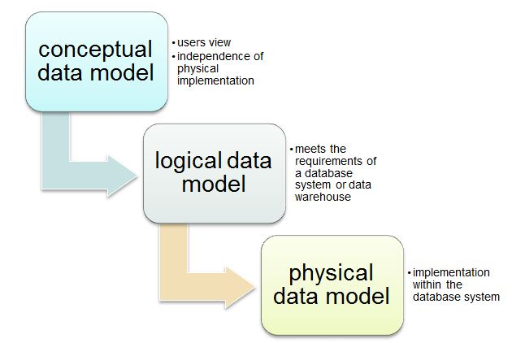

# Intermediate Tutorial

## Contents
- [Background on Joins](#background)
  - [Combining Data](#combining-data)
- [Creating Databases](#creating-databases)
  - [Data Modeling](#data-modeling)
  - [Types of Database Models](#types-of-database-models)
- [Sources](#sources)


# Background

One of the biggest issues beginning SQL writers have is being able to write queries that use more than one table. This can be solved with a join. In this section, we are going to show you how to write a query that combines, or joins, data from more than one table. Once you have gone through the examples you will understand how to write the basic commands to make this happen and why data is separated in the first place. This image below walks through the different types of joins and how they work individually.


When databases are developed, care is taken to ensure redundant data is minimized.  The databases go through a process called normalization that help reduce each database table to a single meaning or purpose. For instance, if I had a table containing all the students and their classes, then wanted to change a student’s name, I would have to change it multiple times, once for each class the student enrolled in. Normalizing separates the data into a Student and Classes table.   This makes it really easy to update the student name, but the price for this is that we have to piece the data back together to answer most of the questions we ask the database.

That is exactly why we need joins.


## Combining Data

Suppose we have a database for all the companies in Santa Barbara. We have two different tables: companies and positions. The names table contains the columns `company_name`, and `employee_id`, a unique number assigned to each employee. The employee table contains the columns `employee_id`, `name`, and `position`.

Note that there are some missing rows from both tables - Appfolio's' employee information is missing from the Positions table, and a row with employee_id hc_18 is missing from the Companies table.

#### Companies
Company_Name | Employee_Id |
--- | --- |
Carpe Data | tn_19 |
Invoca | rw_20 |
Impact Radius | lm_20 |
Appfolio | jr_21 |
HG Data | dr_16 |

#### Positions
Employee_Id | Name | Position |
--- | --- | --- |
tn_19 | Timmy | Data Scientist Intern
rw_20 | Richa | Software Engineer |
hc_18 | Holly | Financial Analyst
dr_16 | Daniel | Actuarial Analyst
lm_20 | Leslie | Consultant

To compute the company of Daniel the Actuarial Analyst, we have to use information in both tables. We can merge the tables on the employee_id column, creating a new table with both company name and position. To do so, we'll need to use a SQL join. Database joins are used to match rows between tables to allow us to stitch the database back together to make it easy to read and use.  In most cases we’re matching a column value from one table with another.

In this section we'll work together to explore all the different joins that exist in SQL.

# Creating Databases

The second part of the intermediate tutorial focuses on creating databases. If you are applying for a career involving databases – whether you want to be an engineer, an administrator, or a warehousing professional – you will need to show off your knowledge of both database lingo and function. Just as important as navigating databases is knowing how to create and organize them; having a strong understanding of schemas and tables will help you nail that interview and land the job!

## Data Modeling

Data modeling is the diagram representation showing how the entities are related to each other. Generally, the data models are created in data analysis & design phase of software development life cycle. It is the initial step towards database design. We first create the conceptual model, then logical model and finally move to the physical model. The level of complexity and detail increases from conceptual to logical to a physical data model.

**The conceptual model** shows a very basic high level of design while the physical data model shows a very detailed view of design. The conceptual model will be just portraying entity names and entity relationships.

**The logical model** will be showing up entity names, entity relationships, attributes, primary keys and foreign keys in each entity.

**The physical data model** will be showing primary keys, foreign keys, table names, column names and column data types. This view actually elaborates how the model will be actually implemented in the database.

The image below breaks down the pipeline.



## Types of Database Models
There are many kinds of data models. Some of the most common ones include:

- Hierarchical database model
- Relational model
- Network model
- Object-oriented database model
- Entity-relationship model
- Document model
- Entity-attribute-value model
- Star schema
- The object-relational model, which combines the two that make up its name

The biggest factor is whether the database management system you are using supports a particular model. Most database management systems are built with a particular data model in mind and require their users to adopt that model, although some do support multiple models.

In addition, different models apply to different stages of the database design process. High-level conceptual data models are best for mapping out relationships between data in ways that people perceive that data. Record-based logical models, on the other hand, more closely reflect ways that the data is stored on the server.

Selecting a data model is also a matter of aligning your priorities for the database with the strengths of a particular model, whether those priorities include speed, cost reduction, usability, or something else.

In this section, we'll work on creating our own database to work with. This will come in handy when we don't have another person's schema to test our queries with!

Now that you have a little bit of background, let's begin! To start, open up the intermediate notebook by typing into your terminal:

#### Mac
```
$ jupyter notebook intermediate/intermediate_notebook.ipynb
```

#### Windows
```
$ jupyter notebook intermediate\intermediate_notebook.ipynb
```


## Sources
This curriculum has drawn heavily the following online resources:
- [Wikipedia: Relational database](https://en.wikipedia.org/wiki/Relational_database)
- [w3schools' SQL tutorial](https://www.w3schools.com/sql/)
- [Berkeley DS 100 Textbook](https://www.textbook.ds100.org/ch09/sql_intro.html)
